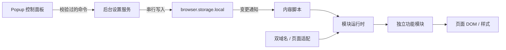

# 架构决策

## 当前边界

首阶段的目标是建立可演进的浏览器扩展基础。已通过 Chrome 查看外网入口的登录后首页与习题页；内网入口当前返回 `ERR_CONNECTION_CLOSED`。双域名配置完成不代表内网验收完成。

### 实际站点观察（2026-09-27）

- 首页提供学习、模测、评测、进度等普通链接入口；学习链接 `/problems/exercises` 本次导航落在 `/problems/tag/...`，模块应匹配实际路径族，而非写死某个标签或账号 ID。
- 习题页 DOM 包含 `.ui.fixed.borderless.menu`、`.pusher`、侧边菜单及 `.ui.table`。页面声明加载 Semantic UI 2.4.1、jQuery 3.3.1 与站点自身样式和脚本。以上是 DOM 和资源标签观察，不推断服务器技术栈。
- 继续使用隔离内容脚本和局部 CSS；不替换站点全局库，不依赖其内部 JavaScript 对象。具体业务模块引入时，再在站点适配层确认对应容器和动态更新行为。
- 本次未操作提交题目、账户设置、聊天或登录凭证功能；仓库仅记录页面结构，不保存账号数据或页面快照。

## 工具链比较

| 方案 | 收益 | 本项目的代价 |
| --- | --- | --- |
| 原生 Manifest + 手写 Vite 构建 | 完全控制输出和目录 | 多入口、热更新、打包以及上下文清理约定需自己维护 |
| CRXJS | 沿用 Vite 和 manifest 驱动的工作流，支持内容脚本热更新 | 仍需独立组织扩展生命周期、设置与模块边界 |
| Plasmo | 入口约定及存储、消息工具完整，支持多种 UI 框架 | 可以满足需求，但本阶段主要工作是 DOM 增强，其组件集成优势暂不突出 |
| **WXT** | 多入口、MV3 构建、上下文失效通知、后续跨浏览器路径 | 需要遵循入口约定，并将业务契约保持在框架之外 |

选择 **WXT + 严格 TypeScript + 原生 DOM/CSS**。不宣称它在所有项目中最快；这是一项围绕当前需求、依赖范围及维护成本的工程选择。包版本与 lockfile 固定，实际输出体积通过构建检查。暂不引入 React/Vue、全局状态库、通用事件总线或依赖注入容器。以后复杂面板可以独立选用组件库，不改变模块运行时。

参考官方资料：[WXT](https://wxt.dev/guide/introduction)、[内容脚本生命周期](https://wxt.dev/guide/essentials/content-scripts)、[CRXJS](https://crxjs.dev/guide/introduction/)、[Plasmo](https://docs.plasmo.com/)。

## 执行与数据边界

- **站点配置**是唯一域名来源，两个入口对应同一产品，不自动跳转、不跨入口请求，也不复制登录状态。匹配模式采用精确主机名；运行时通过 `URL.origin` 限定到 HTTPS 的 8888 端口。
- **内容脚本**运行在隔离环境，直接操作共享 DOM。当前没有主世界脚本或网页消息桥。页面本身不能通过一个公开消息入口修改设置。
- **功能目录**按能力划分，每个模块独立注册、匹配和加载。元数据与实现分离，面板不会导入 DOM 改造代码。动态 import 是按需初始化边界；构建器可能将内容脚本依赖内联，不承诺模块一定成为独立网络分包。
- **后台设置服务**是设置的唯一应用层写入点，每次从持久存储读取最新数据，再串行执行字段更新。后台可以休眠，不依赖内存缓存作为数据来源。内存队列只协调当前实例的并发；后台异常终止时客户端得到失败并可重试，操作是幂等的布尔赋值。
- **消息协议**校验频道、命令、布尔参数、模块 ID，以及扩展 ID 和发送页面。持久数据独立校验 `schemaVersion`，拒绝未知版本，避免旧版覆盖未来数据。

Chrome 的 [后台生命周期](https://developer.chrome.com/docs/extensions/develop/concepts/service-workers/lifecycle) 和 [消息传递](https://developer.chrome.com/docs/extensions/develop/concepts/messaging) 是上述约束的基础。

## 生命周期与性能

1. 精确检查站点后，订阅设置变更，再读取初始快照，防止读取期间发生的更新被旧快照覆盖。
2. 只有全局开关和模块开关都开启、路径匹配成功时，才调用该模块的加载与挂载。
3. 每个实例持有独立 `Scope`。关闭、路由变化或上下文失效会先取消任务，再逆序释放资源。已经失效的异步加载结果不会挂载；失效后才注册的清理函数立即执行。
4. 模块加载、匹配或挂载失败只停止该模块；清理函数异常也不会中断其他清理。
5. 当前目标是 Chromium 120+。同文档导航使用 Navigation API 的 `currententrychange`，并监听 `popstate`、`hashchange`；完整导航由浏览器重新执行脚本。避免常驻路由轮询和修改网站的 History 方法。页面返回缓存时保留实例，恢复时重新核对 URL。
6. 初始框架没有全站 MutationObserver、定时扫描或网络任务。后续需要处理动态列表时，由具体模块观察最小容器、处理新增节点并在 Scope 中断开观察器。
7. 示范模块使用可移除的局部功能样式表。复杂新面板使用 Shadow DOM；针对网页原有样式的覆盖由各模块单独管理，不引入全局 CSS reset。

## 未来接入服务器

目前没有服务端接口、HTTP 客户端、鉴权、同步任务或服务地址配置。预留的是依赖方向：

- 界面及模块依赖功能的类型契约，不直接依赖远端 URL。
- 后续具体业务出现时，在 `shared/` 增加该业务的数据和命令模型，在 `background/` 中实现应用服务，在 `platform/` 中添加相应 HTTP 适配器。
- 服务器请求从后台发送，凭据不进入网页 DOM；只申请实际服务域名权限，校验发送者与响应数据，支持取消和有界超时。
- 本地视觉功能继续离线工作。远程同步与本地设置存储是两种职责，不将同步简单替换为远端读写。
- 服务只能提供经校验的数据；模块始终随扩展打包，不执行远程 JavaScript。

在出现真正的第二个服务实现之前，不添加空接口、假服务器和通用 RPC 框架。

## 验证范围

保留严格类型检查、格式检查、生产构建；仅执行少量临时断言，覆盖域名/端口边界、设置校验、并发字段更新、模块停用期间的异步加载及清理。临时测试文件验证完删除。

外网首页和习题页已完成只读查看，GitHub 公开仓库已通过浏览器创建并克隆接入本地源码。自动化浏览器的 URL 策略禁止访问 `chrome://extensions/`，因此未加载扩展；键盘交互、设置即时生效及安装后的导航清理仍需在加载后验收。内网入口需在可连通的网络环境验证。

2026-09-27 本地验证结果：

- Biome 检查与 TypeScript 严格类型检查通过。
- WXT 0.21.4 / Vite 8.3.1 的 Chrome MV3 生产构建通过，总计 18,933 字节（约 18.9 KB）。
- 四组临时断言通过：域名/端口与协议/设置校验；并发字段写入与存储失败恢复；延迟加载取消、重复挂载、导航和资源清理；正式 Manifest 的权限及入口。
- 临时断言使用现有开发依赖与 Node 内置断言执行，没有安装测试框架；验证后删除测试源文件和生成脚本。
